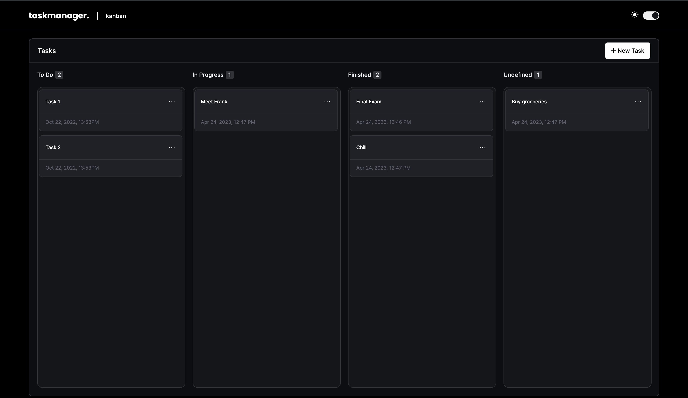
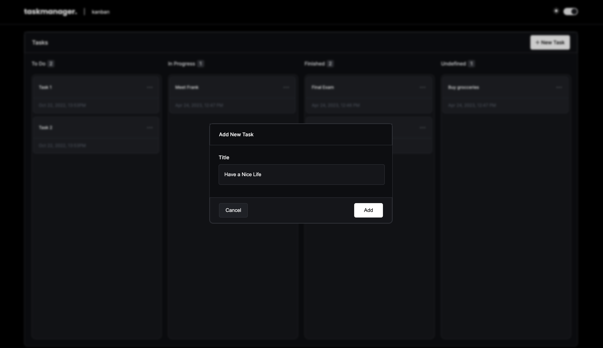
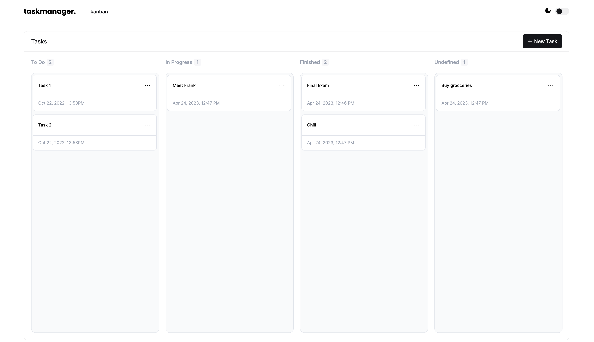
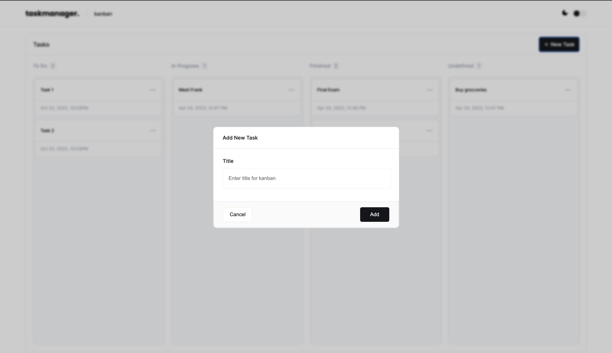
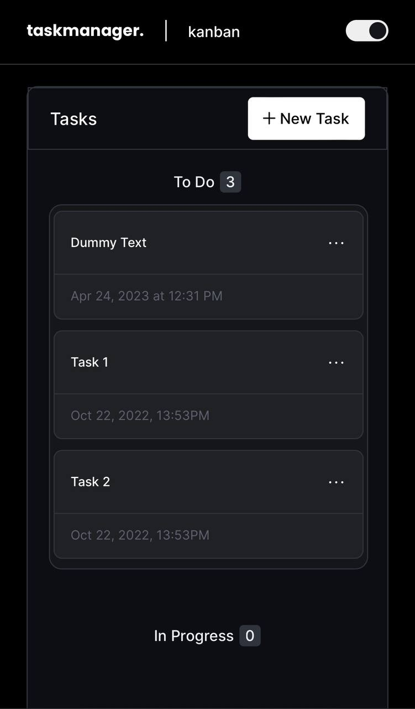
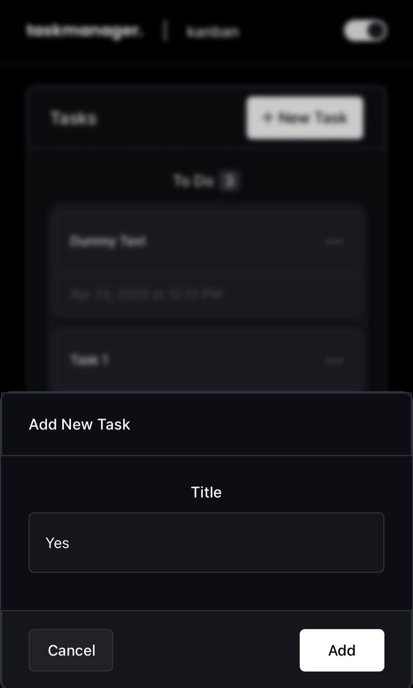
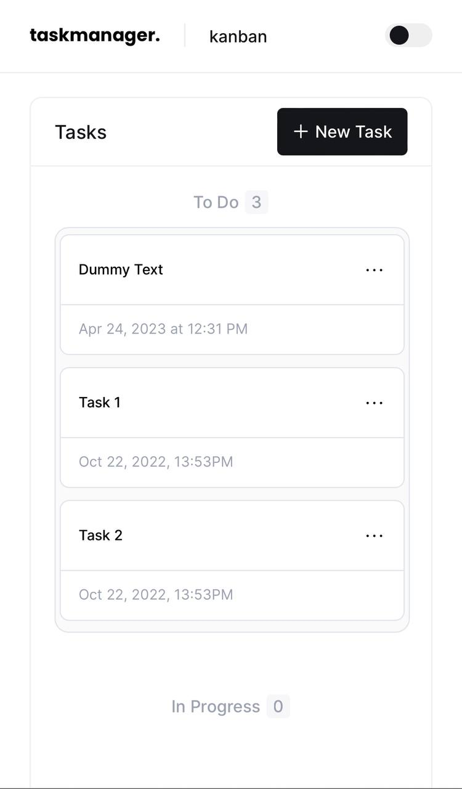
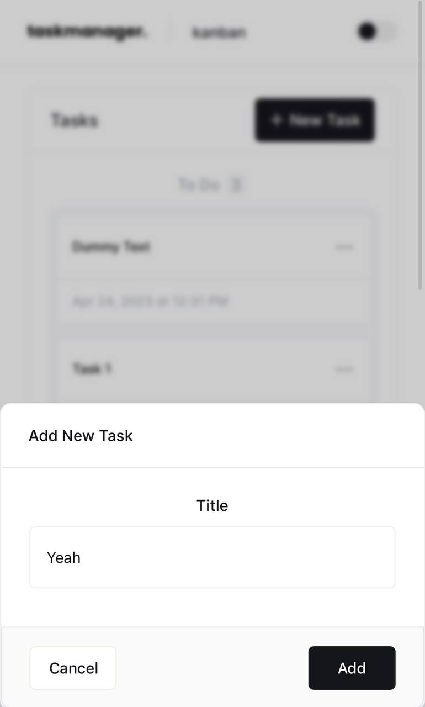

# kannban
> This project is a React application that allows users to manage their tasks with the Kanban board system. It was built using React, Redux, ReduxToolkit,uuid, and React-Beuatiful-Dnd.

> Live demo [_here_](https://kannban.vercel.app/). <!-- If you have the project hosted somewhere, include the link here. -->

## Table of Contents
* [General Info](#general-information)
* [Technologies Used](#technologies-used)
* [Features](#features)
* [Screenshots](#screenshots)
* [Setup](#setup)
* [Project Status](#project-status)
* [Room for Improvement](#room-for-improvement)
* [Contact](#contact)


## General Information
- Organize your Task using Kanban technique
- It was really interesting idea to create not just a simple task manager, but add drag and drop feature for better UX and practice skills


## Technologies Used
- React
- Redux, ReduxToolKitн
- React-Beautiful-dnd(rbd)
- uuid


## Features
- CRUD operations with tasks
- Dark and White themes
- Drag and Drop of Tasks between columns


## Screenshots
**Desktop Version**

Dark Theme



White Theme



**Mobile Version**








## Setup

Proceed to describe how to install / setup one's local environment / get started with the project.
Clone the GitHub repository to your local machine using the following command in your terminal:
```
git clone https://github.com/Lgxn71/kannban.git
```
Once the repository is cloned, navigate to the project directory using the following command:
```
cd <project directory>
```
Install the required dependencies by running the following command:

```
npm install
```

Once the dependencies are installed, you can start the development server by running the following command:

```
npm start
```


## Project Status
Project is:  _complete_ 

## Room for Improvement
Room for improvement:
- Add session, cookies, authentification  and database 

## Contact
Created by lgxn
[telegram](https://t.me/lgxn71)
[linkedin](https://www.linkedin.com/in/lgxn71/)
